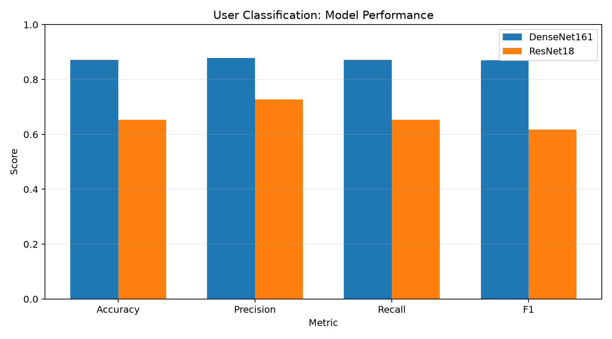
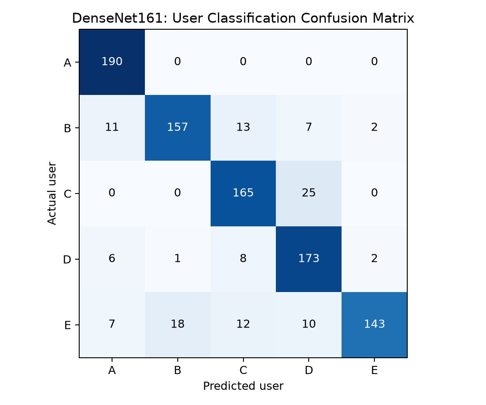
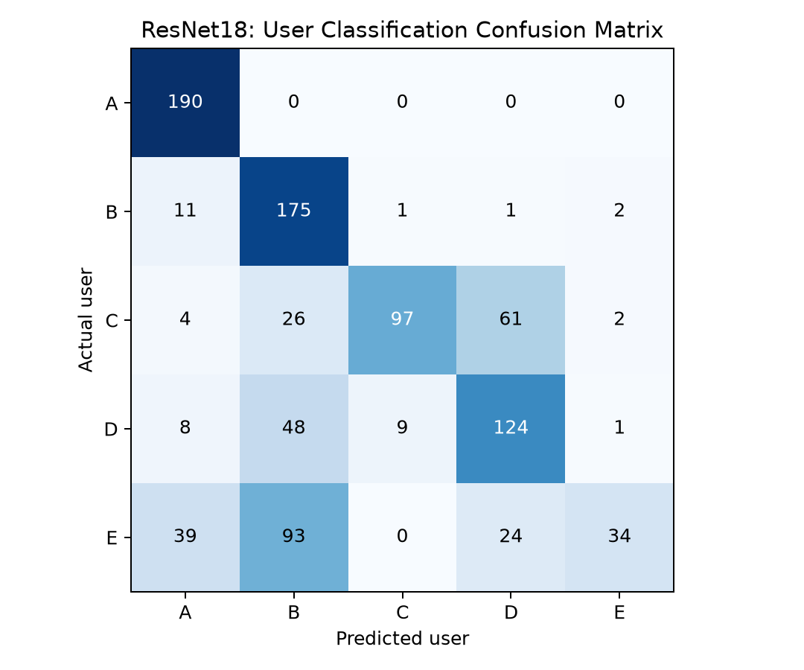
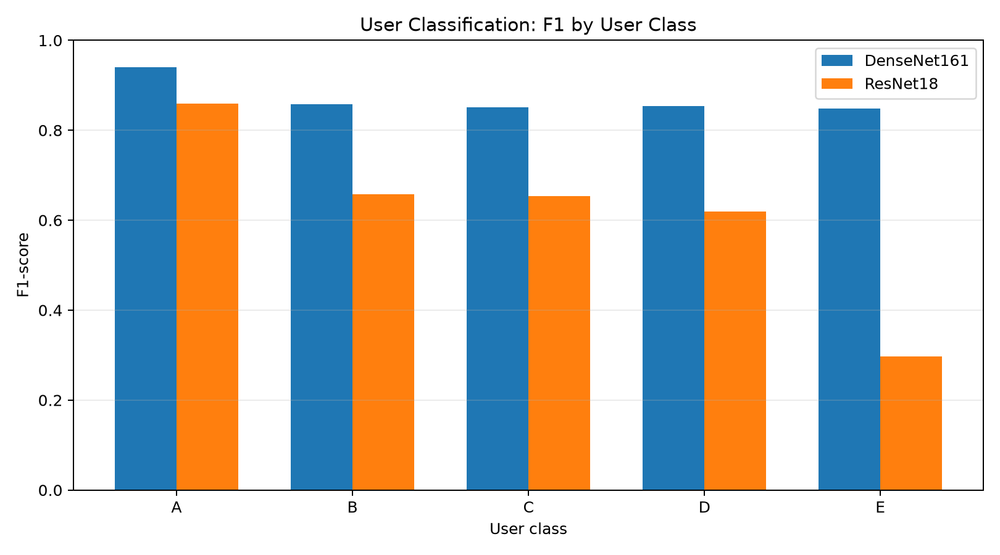

# sEMG 사용자 인증 모델 비교

## 프로젝트 개요

손바닥 회전 동작에서 측정한 sEMG 데이터를 이용해 사용자 A~E를 분류하는 프로젝트입니다.

1주차에서는 데이터의 특징을 분석하고  
2주차에서는 CWT 변환과 DenseNet161 학습을 진행했습니다.

3주차에서는 DenseNet161과 ResNet18을 이용해 사용자 분류 성능을 비교하고 Accuracy, Precision, Recall, F1-score와 Confusion Matrix를 확인했습니다.

---

## 데이터 구성

데이터는 사용자 A~E 총 5명으로 구성되어 있으며 각 사용자별로 50개의 CSV 파일을 사용합니다.

전체 데이터는 총 250개입니다.

데이터는 아래 경로에 배치하여 사용합니다.

```text
data/
└─ data/
   ├─ A/
   ├─ B/
   ├─ C/
   ├─ D/
   └─ E/
```

현재 데이터 분할은 CSV 파일 단위로 진행합니다.

- Train: 80%
- Test: 20%
- random_state: 42

파일을 먼저 Train/Test로 나눈 뒤 각 파일에서 window를 생성하기 때문에 같은 시행에서 생성된 window가 Train과 Test에 동시에 포함되지 않도록 했습니다.

---

## 데이터 전처리

현재 코드에서 사용하는 전처리 과정은 다음과 같습니다.

```text
sEMG CSV
→ 60 Hz notch filter
→ 20~499 Hz band-pass filter
→ 300 ms window
→ 150 ms hop
→ min-max normalization
→ Morlet CWT
→ (3, 32, 300) 형태의 입력 데이터 생성
```

CWT 변환을 통해 시간 영역의 sEMG 신호를 시간-주파수 형태로 변환한 뒤 딥러닝 모델의 입력으로 사용했습니다.

---

## 프로젝트 구조

```text
semg-auth/
├─ week1/
│  ├─ week1_analysis.py
│  ├─ week1_extract.py
│  └─ 분석 결과 이미지 및 CSV
│
├─ week2/
│  ├─ week2.py
│  ├─ make_report_png.py
│  └─ 전처리 및 학습 결과 이미지
│
├─ week3/
│  ├─ week3.py
│  ├─ improve.py
│  ├─ model_comparison.csv
│  ├─ model_comparison.png
│  ├─ confusion_matrix_densenet161.png
│  ├─ confusion_matrix_resnet18.png
│  ├─ class_f1_comparison.png
│  ├─ evaluation_summary.txt
│  └─ improved/
│
├─ main.py
├─ README.md
└─ .gitignore
```

`.pth` 모델 checkpoint와 원본 `data/` 폴더는 GitHub 용량 문제로 저장소에 포함하지 않았습니다.

---

## 사용 모델

### DenseNet161

2주차에서 사용한 기본 분류 모델입니다.

CWT로 변환한 sEMG 데이터를 입력으로 사용하고 마지막 classifier를 사용자 5명 분류에 맞게 변경했습니다.

현재 기본 비교 결과는 5 epoch 학습 모델을 기준으로 평가했습니다.

### ResNet18

DenseNet161과 비교하기 위해 추가한 모델입니다.

DenseNet161과 동일한 데이터와 전처리 결과를 사용하며 최종 출력층을 사용자 5명 분류에 맞게 변경했습니다.

현재 기본 비교 결과는 1 epoch 학습 결과입니다.

---

## 실행 방법

먼저 공개 데이터 저장소에서 데이터를 다운로드한 뒤 위의 데이터 구조에 맞게 배치합니다.

Python 가상환경을 활성화합니다.

```powershell
.\.venv\Scripts\activate
```

모델 checkpoint는 GitHub에 포함하지 않았기 때문에 처음 실행하는 경우 2주차 학습을 먼저 진행합니다.

```powershell
python week2\week2.py
```

이후 3주차 모델 비교를 실행합니다.

```powershell
python week3\week3.py
```

실행이 끝나면 `week3/` 폴더에 모델 평가 결과와 그래프가 생성됩니다.

---

## 현재 모델 성능 비교

현재 기본 실험 결과는 다음과 같습니다.

| Model | Accuracy | Precision (macro) | Recall (macro) | F1 (macro) |
|---|---:|---:|---:|---:|
| DenseNet161 | 0.8716 | 0.8781 | 0.8716 | 0.8704 |
| ResNet18 | 0.6526 | 0.7269 | 0.6526 | 0.6176 |

현재 기준에서는 DenseNet161이 Accuracy와 F1-score 모두 ResNet18보다 높은 결과를 보였습니다.

단 ResNet18은 1 epoch만 학습한 초기 결과이기 때문에 모델 구조 자체의 성능 차이라고 단정하기는 어렵습니다.



---

## Confusion Matrix

### DenseNet161



DenseNet161에서는 사용자 A가 가장 안정적으로 분류되었습니다.

가장 많이 발생한 오분류는 사용자 C를 D로 예측한 경우였습니다.

### ResNet18



ResNet18에서는 사용자 E의 분류 성능이 상대적으로 낮았으며 E를 B로 잘못 분류하는 경우가 많이 나타났습니다.

---

## 클래스별 F1-score

각 사용자별 F1-score를 DenseNet161과 ResNet18에서 비교했습니다.



DenseNet161은 전체 사용자에서 ResNet18보다 높은 F1-score를 보였습니다.

특히 사용자 E에서 두 모델의 성능 차이가 크게 나타났습니다.

---

## 결과 분석

현재 기본 실험에서는 DenseNet161이 ResNet18보다 높은 사용자 분류 성능을 보였습니다.

DenseNet161의 Accuracy는 약 87.16%였으며 사용자 A는 안정적으로 분류되었습니다.

반면 사용자 C와 D 사이에서 일부 오분류가 발생했고 사용자 E도 다른 클래스에 비해 오분류가 많이 나타났습니다.

현재 결과는 DenseNet161 5 epoch와 ResNet18 1 epoch를 비교한 결과이기 때문에 동일한 학습 조건의 최종 비교 결과는 아닙니다.

현재 DenseNet161의 재현 정확도를 높이기 위한 추가 학습과 설정 비교를 진행하고 있으며 이후 ResNet18의 epoch도 증가시켜 최종 결과를 다시 비교할 예정입니다.

---

## 추가로 생각한 활용방안

사용자마다 sEMG 신호의 크기와 패턴에 차이가 있다는 점을 이용하면 개인을 구분하는 생체 인증 방식으로 활용할 수 있을 것이라고 생각했습니다.

또한 근육의 전기적 활성 패턴을 학습할 수 있다면 사용자가 의도한 움직임을 구분해 의수 제어나 재활 보조 장치 같은 분야에도 활용할 수 있을 것이라고 생각했습니다.

---

## 데이터 출처

사용한 sEMG 데이터는 아래 공개 저장소의 데이터를 사용했습니다.

https://github.com/sea3551/palm-sEMG-doorknob-filtered

---

## 참고

현재 저장소에서는 용량 문제로 `.pth` 모델 checkpoint와 원본 `data/` 폴더를 Git에 포함하지 않았습니다.

동일한 실험을 재현하려면 원본 데이터를 다운로드하여 위의 데이터 구조에 맞게 배치한 뒤 학습 코드를 실행하면 됩니다.

현재 성능 수치는 기본 실험 결과이며 추가 학습이 완료되면 최종 DenseNet161과 ResNet18 결과로 갱신할 예정입니다.