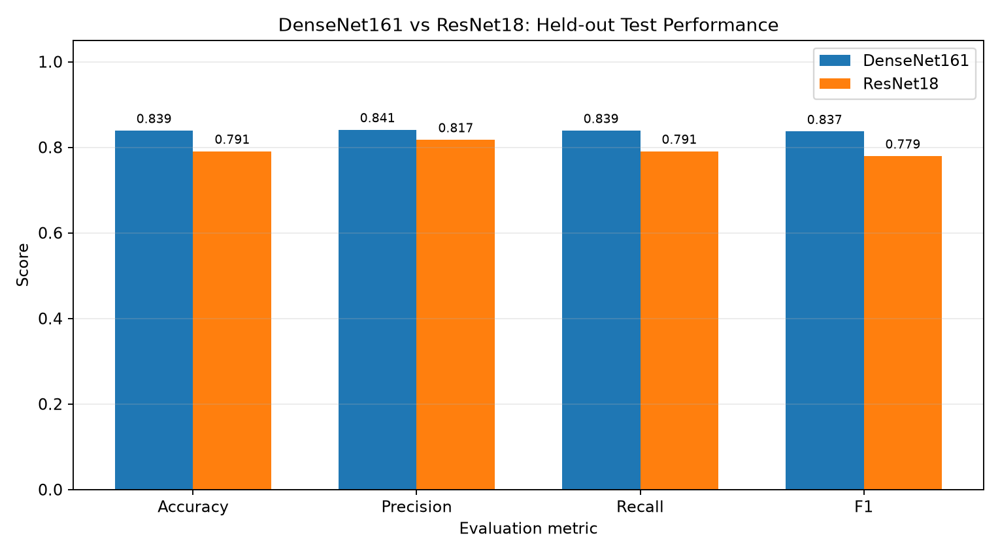
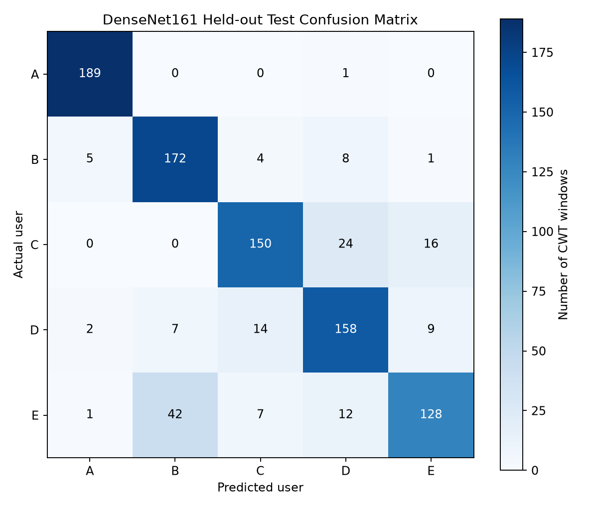
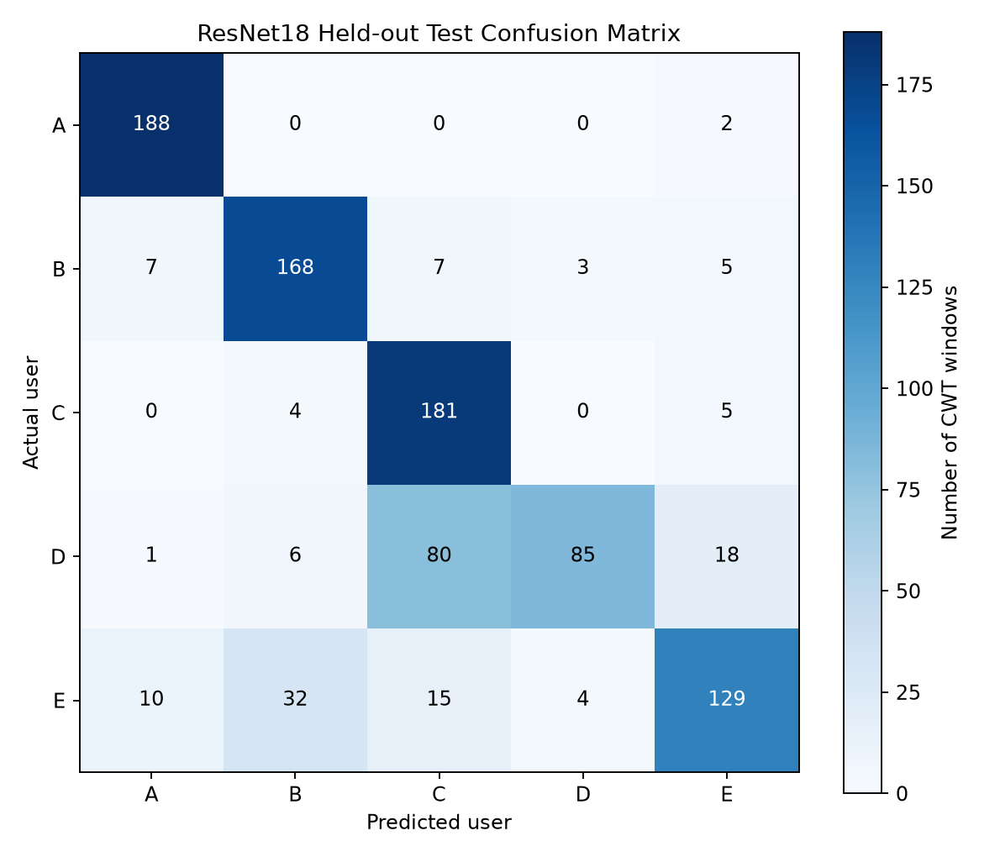
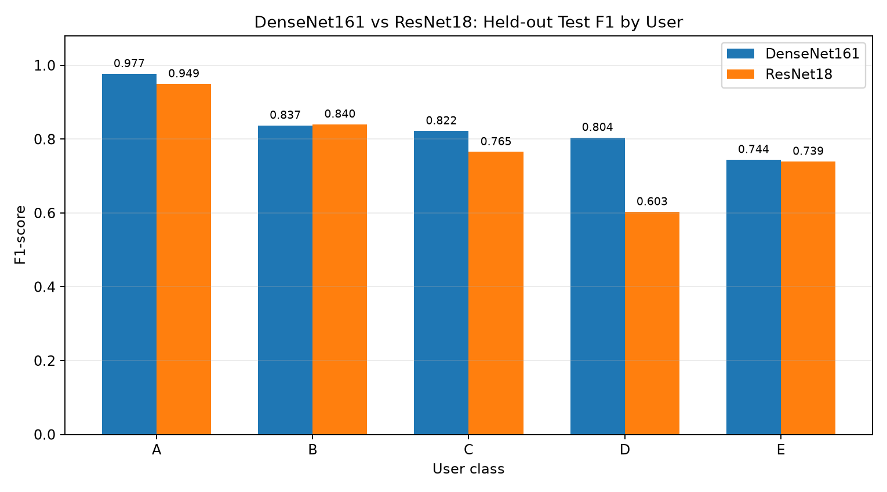

# sEMG 사용자 인증 모델 비교

## 프로젝트 개요

손바닥 회전 동작에서 측정한 sEMG 데이터를 이용해 사용자 A~E를 분류하는 프로젝트입니다.

1주차에서는 데이터의 특징을 분석하고  
2주차에서는 CWT 변환과 DenseNet161 학습을 진행했습니다.

3주차에서는 DenseNet161과 ResNet18을 이용해 사용자 분류 성능을 비교하고 Accuracy, Precision, Recall, F1-score와 Confusion Matrix를 확인했습니다.

---

## 데이터 구성

데이터는 사용자 A~E 총 5명으로 구성되어 있으며 각 사용자별로 50개의 CSV 파일을 사용합니다.

전체 데이터는 총 250개입니다.

데이터는 아래 경로에 배치하여 사용합니다.

```text
data/
└─ data/
   ├─ A/
   ├─ B/
   ├─ C/
   ├─ D/
   └─ E/
```

최종 비교는 CSV 파일 단위로 stratified 분할한 160개 Train / 40개 Validation / 50개 Test를 사용합니다. 먼저 기존 80:20 Train/Test 분할(`random_state=42`)을 유지하고, Train 안에서 Validation을 분리했습니다. 분할 명세는 [`split_manifest.json`](week3/reproduction/split_manifest.json)에 저장되어 있습니다. 같은 CSV에서 생성한 window가 서로 다른 집합에 섞이지 않습니다.

---

## 데이터 전처리

최종 동일 조건 비교에서 사용하는 전처리 과정은 다음과 같습니다.

```text
sEMG CSV (배포 시 60 Hz notch 및 20~500 Hz band-pass 필터 적용됨)
→ 300 ms window
→ 150 ms hop
→ min-max normalization
→ Morlet CWT
→ (3, 32, 300) 형태의 입력 데이터 생성
```

CWT 변환을 통해 시간 영역의 sEMG 신호를 시간-주파수 형태로 변환한 뒤 딥러닝 모델의 입력으로 사용했습니다.

최종 실험에서는 이미 필터링된 배포 CSV에 notch/band-pass를 다시 적용하지 않았습니다. 초기 week2/week3 실험에는 기존 전처리 코드의 추가 필터가 적용되어 있으므로 초기 결과와 최종 결과를 학습 epoch만의 효과로 비교하지 않습니다.

---

## 프로젝트 구조

```text
semg-auth/
├─ week1/
│  ├─ week1_analysis.py
│  ├─ week1_extract.py
│  └─ 분석 결과 이미지 및 CSV
│
├─ week2/
│  ├─ week2.py
│  ├─ make_report_png.py
│  └─ 전처리 및 학습 결과 이미지
│
├─ week3/
│  ├─ week3.py
│  ├─ improved/
│  ├─ reproduction/
│  │  ├─ train_densenet_reproduction.py
│  │  ├─ evaluate_best.py
│  │  ├─ split_manifest.json
│  │  └─ resnet/resnet_experiment.py
│  └─ final/
│     ├─ build_final.py
│     ├─ model_comparison.csv
│     ├─ model_comparison.png
│     ├─ confusion_matrix_densenet161.png
│     ├─ confusion_matrix_resnet18.png
│     ├─ class_f1_comparison.png
│     └─ evaluation_summary.txt
│
├─ main.py
├─ README.md
└─ .gitignore
```

`.pth` 모델 checkpoint와 원본 `data/` 폴더는 GitHub 용량 문제로 저장소에 포함하지 않았습니다.

---

## 사용 모델

### DenseNet161

2주차에서 사용한 기본 분류 모델입니다.

CWT로 변환한 sEMG 데이터를 입력으로 사용하고 마지막 classifier를 사용자 5명 분류에 맞게 변경했습니다.

최종 비교에는 Validation 기준 best인 7 epoch checkpoint를 사용했습니다.

### ResNet18

DenseNet161과 비교하기 위해 추가한 모델입니다.

DenseNet161과 동일한 데이터와 전처리 결과를 사용하며 최종 출력층을 사용자 5명 분류에 맞게 변경했습니다.

최종 비교에는 Validation 기준 best인 3 epoch checkpoint를 사용했습니다.

---

## 실행 방법

먼저 공개 데이터 저장소에서 데이터를 다운로드한 뒤 위의 데이터 구조에 맞게 배치합니다.

Python 가상환경을 활성화합니다.

```powershell
.\.venv\Scripts\activate
```

최종 제출용 표와 그래프는 저장된 평가 CSV만으로 다시 만들 수 있습니다. 이 명령은 학습하거나 Test set을 다시 평가하지 않습니다.

```powershell
python week3\final\build_final.py
```

`week3/final/` 결과가 이미 있다면 덮어쓰기를 막기 위해 명령이 종료됩니다. 처음부터 재현할 때는 원본 데이터를 같은 구조로 배치하고, 아래 명령으로 학습한 뒤 Validation best checkpoint를 평가할 수 있습니다. 평가 명령은 각 모델당 Test 최초 평가 시 한 번만 실행해야 합니다.

```powershell
python week3\reproduction\train_densenet_reproduction.py --until 10
python week3\reproduction\evaluate_best.py
python week3\reproduction\resnet\resnet_experiment.py --until 5
python week3\reproduction\resnet\resnet_experiment.py --evaluate
```

두 학습 모두 seed 42, Adam, learning rate 0.001, batch size 16, CrossEntropyLoss를 사용했습니다. `.pth` checkpoint는 Git에 포함하지 않았습니다. 이 저장소에는 이번 실행의 평가 CSV와 최종 그래프가 포함됩니다.

---

## 최종 동일 조건 모델 성능 비교

두 모델은 같은 CSV 단위 split과 전처리를 사용했고, Validation Accuracy로 best checkpoint를 선택한 뒤 동일한 held-out Test 50개 CSV에서 평가했습니다. 점수는 Test CSV에서 생성한 **950개 CWT window 단위**이며 Precision, Recall, F1은 macro 평균입니다. 원본 수치는 [`model_comparison.csv`](week3/final/model_comparison.csv)에 있습니다.

| Model | Best epoch | Validation Accuracy | Test Accuracy | Precision (macro) | Recall (macro) | F1 (macro) |
|---|---:|---:|---:|---:|---:|---:|
| DenseNet161 | 7 | 0.8250 | 0.8389 | 0.8409 | 0.8389 | 0.8368 |
| ResNet18 | 3 | 0.7737 | 0.7905 | 0.8175 | 0.7905 | 0.7794 |

DenseNet161의 Test Accuracy가 ResNet18보다 **4.84%p** 높았습니다. DenseNet161의 **94% 재현 목표는 달성하지 못했습니다**(Test Accuracy 83.89%).



---

## Confusion Matrix

### DenseNet161



DenseNet161의 클래스별 F1은 A 0.9767, B 0.8370, C 0.8219, D 0.8041, E 0.7442입니다.

### ResNet18



ResNet18에서는 **실제 D를 C로 예측한 경우가 80개 window**로 가장 많았습니다.

---

## 클래스별 F1-score

각 사용자별 F1-score를 DenseNet161과 ResNet18에서 비교했습니다.



DenseNet161은 A~E 모든 클래스에서 ResNet18보다 높은 F1-score를 기록했습니다.

두 모델의 F1 차이가 가장 큰 클래스는 D입니다(DenseNet161 0.8041, ResNet18 0.6028).

---

## 결과 분석

최종 동일 조건 비교에서는 DenseNet161이 Accuracy, macro Precision, macro Recall, macro F1 모두 높았습니다. 특히 ResNet18의 D 클래스 F1이 0.6028로 낮았고 D→C 오분류가 80개 window였습니다. 이 결과만으로 오분류 원인을 단정할 수는 없습니다.

### 초기 실험 기록

초기 결과는 기존 [`week3/model_comparison.csv`](week3/model_comparison.csv)에 보존했습니다. DenseNet161 5 epoch의 Test Accuracy는 0.8716, ResNet18 1 epoch는 0.6526이었습니다. 이 초기 실험은 최종 reproduction과 전처리 조건이 달라 메인 성능표에 섞지 않았습니다.

---

## 추가로 생각한 활용방안

사용자마다 sEMG 신호의 크기와 패턴에 차이가 있다는 점을 이용하면 개인을 구분하는 생체 인증 방식으로 활용할 수 있을 것이라고 생각했습니다.

또한 근육의 전기적 활성 패턴을 학습할 수 있다면 사용자가 의도한 움직임을 구분해 의수 제어나 재활 보조 장치 같은 분야에도 활용할 수 있을 것이라고 생각했습니다.

---

## 데이터 출처

사용한 sEMG 데이터는 아래 공개 저장소의 데이터를 사용했습니다.

https://github.com/sea3551/palm-sEMG-doorknob-filtered

---

## 참고

현재 저장소에서는 용량 문제로 `.pth` 모델 checkpoint와 원본 `data/` 폴더를 Git에 포함하지 않았습니다.

동일한 실험을 재현하려면 원본 데이터를 다운로드하여 위의 데이터 구조에 맞게 배치한 뒤 학습 코드를 실행하면 됩니다.

메인 성능표는 저장된 동일 조건 reproduction 결과입니다. 상세 기록은 [`week3/final/evaluation_summary.txt`](week3/final/evaluation_summary.txt)에 있습니다.
